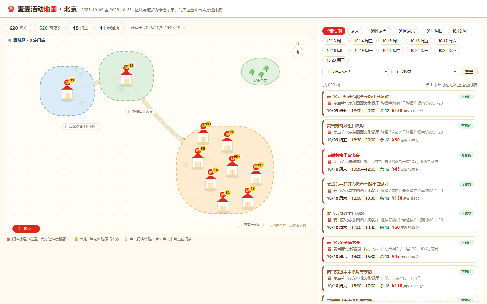

<div align="center">



# 🍟 麦麦活动雷达 · McEvent Radar

**「这个周末，附近哪家麦麦有生日派对？哪家读书会还有名额？」**

一句话问出去，回来一张**卡通活动地图**——门店小屋站在官方真实经纬度上，
活动卡片里只装 `query-party-store-session` 亲口确认过的**可预约场次**。

<br>

[](https://nodejs.org/)
[](MCP_INTEGRATION.md)
[](skill/mcd-event-radar/SKILL.md)
[](MCP_INTEGRATION.md#在线验证记录2026-10-09真实-token)
[](LICENSE)

*麦当劳程序员创意开发大赛参赛作品 · 基于麦当劳 MCP Server 的 Agent Skill · 全程使用 WorkBuddy 开发*

</div>

---

## 🧭 30 秒看懂

```
你：附近有什么麦当劳活动？

雷达：📡 扫描北京 · 未来 14 天（2026-10-09 ~ 10-23）
      ✅ 已核实 620 个可预约场次 · 11 类主题活动 · 10 家门店

      🗺️  [卡通活动地图]
          海淀区 · 北师大餐厅 ──────────── 今天 17:30—19:30
              四小福豪华版生日派对  ¥88  余12  点击预约核实
          东城区 · 8 家门店连成一片party区 🎪
          ……

      🎯 离你最近的：北师大餐厅，天天都有四小福豪华版（¥88）
      📅 想看周六？点地图上的日期筛选，36 场任你挑
```

**每个数字都有出处**：620 来自官方场次接口的实时返回，¥88 是拿商城价 88 元
交叉核实过的分单位换算，「余 12」是接口原始 `leftNum`——雷达只转述，不编故事。

---

## 🗺️ 独家亮点：会说真话的卡通地图

大多数活动查询给你一堵文字墙。麦麦活动雷达给你一张**能玩的地图**：

| 地图元素 | 数据来源 | 诚实度 |
| --- | --- | --- |
| 🏠 门店小屋的位置 | `query-party-store` 官方**经纬度**线性投影 | ✅ 真实相对位置（北京实测：单商品即返回 365 家门店全带坐标） |
| 🎪 辖区色块 / 道路 / 公园 | 卡通示意装饰 | ⚠️ 页面明确标注「非精确地图」，不冒充行政区划 |
| 🛣️ 街道标签 | 官方 `address` 字段去门牌号（如「东单北大街112号」→ 东单北大街） | ✅ 真实地址 |
| 🟡 小屋头顶的气泡 | 当前筛选下的场次数，随筛选实时刷新 | ✅ 实时计算 |
| 🎫 活动卡片 | 日期/活动/状态三重筛选 + 门店↔卡片双向联动 | ✅ 全部已核实场次 |

**单文件、零依赖、断网可开**——不调用任何在线地图服务，评审双击 HTML 即可体验。

---

## 🔍 四个实测发现（不是猜的，是联调出来的）

**1️⃣ 官方文档的工具名和线上不一致**
文档写 `query-partystore-date/session`，线上 `tools/list` 实测是
`query-party-store-date/session`。本项目全部按线上实测名对接，并写进自检脚本。

**2️⃣ 场次价格的单位是「分」，而且能自证**
场次接口只给裸数字（如 `13800`）。我们用 `mall-product-detail` 同商品价格交叉核实：
**11/11 商品倍率恒为 ×100**（商城价 138 元 ↔ 场次价 13800），判定单位为分。
`live.mjs` 把这个核验做进了运行时——倍率对得上才显示「¥138」，对不上自动回退
「单位待核实」，官方将来改口径也不会翻车。

**3️⃣ `leftNum` 恒等于 12，疑似容量上限而非实时余量**
上海 116 场、北京 620 场全部返回 12。界面只转述原始值并注明，不吹「名额充足」。

**4️⃣ 门店坐标是官方白送的**
`query-party-store` 原始返回自带 `address / latitude / longitude / shortName`——
这让卡通地图的「真实位置投影」成为可能，也是本项目的地图不画假位置的底气。

> 完整联调记录见 [MCP_INTEGRATION.md](MCP_INTEGRATION.md#在线验证记录2026-10-09真实-token)。

---

## ✨ 功能特性

| | 能力 | 说明 |
| --- | --- | --- |
| 🗺️ | 卡通活动地图 | 门店小屋按官方经纬度投影落位，辖区色块可选标注（`--districts`），自包含 HTML 单文件 |
| 🎫 | 活动卡片面板 | 日期（含周末）/活动类型/预约状态筛选，点击门店筛卡片、点击卡片地图脉冲定位 |
| ✅ | 核实链查询 | 商品 → 城市 → 门店 → 日期 → 场次逐级核实，只把 `leftNum > 0` 标为「可预约」 |
| 🧠 | 小白三步走 | 官方 Token 指南 → 一键配置脚本（自动备份+在线验证+不回显 Token）→ Trust 启用 |
| 📍 | 城市级定位 | 「附近」场景 IP 定位（不收集精确坐标，VPN/代理出口明确提示，结果需确认） |
| 🛡️ | 预约门控 | 默认只查询；下单需用户逐项确认，费用单位未核实时拒绝创建订单 |
| 📤 | 三种导出 | HTML 地图（默认）/ Markdown / JSON，互不依赖 |

---

## 🚀 快速开始

### 方式一 · 30 秒离线体验（无需 Token、无需网络）

```bash
git clone https://github.com/Zafer-Liu/mcd-event-radar.git
cd mcd-event-radar
node skill/mcd-event-radar/scripts/radar.mjs \
  --input examples/sample-events.json --city 上海 --output demo-map.html
```

双击打开 `demo-map.html`——示例数据是虚构的（已明确标注），但地图、筛选、
卡片联动全部真实可玩。**评审可以先用这一步验货，再决定要不要配 Token。**

### 方式二 · 作为 WorkBuddy Skill 使用（完整体验）

1. 到 [麦当劳 MCP 开放平台](https://open.mcd.cn/mcp/doc) 申请 Token（手机号登录 → 控制台 → 激活 → 一键复制）
2. 在 WorkBuddy 导入 `dist/mcd-event-radar-skill.zip` 并启用，对它说「查附近的活动」——
   Skill 会引导你贴 Token，自动完成配置（写前备份、在线验证、绝不回显）
3. 激活连接器（Trust → 启用 → 重开会话）后即可纯对话查询；等不及重启？
   Skill 自带直连兜底，当轮会话就能出结果

配置与排障细节见 [SKILL.md](skill/mcd-event-radar/SKILL.md) 与 [MCP_INTEGRATION.md](MCP_INTEGRATION.md)。

### 方式三 · 命令行直连（零依赖，Node.js 20+）

```powershell
$env:MCD_MCP_TOKEN = Read-Host -MaskInput '麦当劳 MCP Token'
npm run live -- --city 北京 --output events.local.json    # 官方 MCP 实时查询（含门店坐标）
npm run radar -- --input events.local.json --city 北京     # 默认生成卡通活动地图
Remove-Item Env:\MCD_MCP_TOKEN
```

---

## 🧑‍🤝‍🧑 目标用户

| 用户 | 诉求 |
| --- | --- |
| 有娃家庭 | 「周末带娃去哪家麦麦？生日派对/读书会哪场还有名额？」 |
| 活动型麦门 | 「麦麦奇妙夜捣蛋派对、万马奔腾开心派对什么时候开？」 |
| 附近党 | 「别给我一堵文字墙，地图上指给我看哪家店近」 |
| 谨慎型用户 | 「预约前我要看清活动、门店、场次、费用、名额依据」 |

---

## 📁 项目结构

```
mcd-event-radar/
├── README.md                    # 本文件
├── CONTEST_DECLARATION.md       # 参赛声明（官方原文，未改动）
├── MCP_INTEGRATION.md           # MCP 工具、调用流程、在线验证记录
├── workbuddy.md                 # WorkBuddy 真实开发对话上下文（专项奖励材料）
├── mcp-config.example.json      # 脱敏配置示例（仅环境变量占位符）
├── images/
│   └── map-preview.png          # 北京实测地图效果
├── examples/
│   └── sample-events.json       # 虚构演示数据（离线体验用，已标注）
├── dist/
│   └── mcd-event-radar-skill.zip # 可直接导入 WorkBuddy 的 Skill 包
└── skill/mcd-event-radar/       # Skill 源码
    ├── SKILL.md                 # Agent 使用说明书（自检/城市策略/查询链/预约边界）
    └── scripts/
        ├── setup-connector.mjs  # 一键配置（备份+验证+不回显 Token）
        ├── check-connector.mjs  # 连接器体检
        ├── locate.mjs           # 城市级 IP 定位
        ├── live.mjs             # 官方 MCP 直连查询（含门店坐标、价格单位运行时核验）
        ├── radar.mjs            # 结果整理器（默认生成 HTML 卡通地图）
        └── lib/
            ├── mcp-client.mjs   # Streamable HTTP MCP 客户端
            └── html-map.mjs     # 卡通地图渲染器
```

---

## 🛡️ 数据诚实红线

- 查不到就说查不到，说明已查范围与缺失环节；不用搜索结果、模型记忆或示例数据冒充实时结果
- 活动日历 ≠ 预约名额：只有 `query-party-store-session` 明确返回 `leftNum > 0` 才标「可预约」
- 价格展示原始值 + 运行时单位核验；核验不过就写「单位待核实」，不做无依据换算
- 地图页面常驻标注「卡通示意图 · 非精确地图」
- Token 只进本机 `~/.workbuddy/mcp.json`，不进回复、示例、日志和本仓库
- 门店无坐标就放「示意车道」并注明，不猜位置

---

## 📋 参赛材料

| 要求 | 文件 |
| --- | --- |
| 项目介绍/安装/示例/目标用户 | 本 README |
| 参赛声明（官方原文未改动） | [CONTEST_DECLARATION.md](CONTEST_DECLARATION.md) |
| MCP 接入说明 | [MCP_INTEGRATION.md](MCP_INTEGRATION.md) |
| 脱敏 MCP 配置示例 | [mcp-config.example.json](mcp-config.example.json) |
| WorkBuddy 开发上下文 | [workbuddy.md](workbuddy.md) |

---

## License & 声明

[MIT](LICENSE) · 本项目为麦当劳程序员创意开发大赛参赛作品，由参赛者独立开发，
非麦当劳官方产品。活动、价格和名额均以麦当劳官方实时结果为准。
